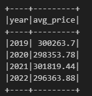
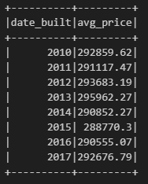
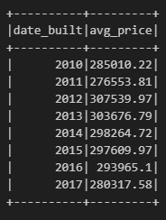
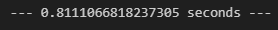
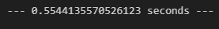
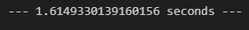

# Home_Sales ReadMe

This script reads in the data from an AWS S3 bucket into the DataFrame, creates a temporary view of the DataFrame, and performs SQL queries to answer questions about home sales from the dataset.

### Dependencies:

* Apache Spark
* Java

### Output

1. What is the average price for a four-bedroom house sold for each year? Round off your answer to two decimal places.

* In 2019, the average price was $300,263.70.
* In 2020, the average price was $298,353.78.
* In 2021, the average price was $301,819.44.
* In 2022, the average price was $296,363.88.

  

2. What is the average price of a home for each year
   it was built that has three bedrooms and three bathrooms? Round off
   your answer to two decimal places.

* In 2010, the average price was $292,859.62.
* In 2011, the average price was $291,117.47.
* In 2012, the average price was $293,683.19.
* In 2013, the average price was $295,962.27.
* In 2014, the average price was $290,852.27.
* In 2015, the average price was $288,770.30.
* In 2016, the average price was $290,555.07.
* In 2017, the average price was $292,676.79.

    

3. What is the average price of a home for each year
   that has three bedrooms, three bathrooms, two floors, and is greater
   than or equal to 2,000 square feet?

* In 2010, the average price was $285,010.22.
* In 2011, the average price was $276,553.81.
* In 2012, the average price was $307,539.97.
* In 2013, the average price was $303,676.79.
* In 2014, the average price was $298,264.72.
* In 2015, the average price was $297,609.97.
* In 2016, the average price was $293,965.10.
* In 2017, the average price was $280,317.58.

    

4. What is the "view" rating for homes costing more
   than or equal to $350,000?

   

   * The initial run time was .81 seconds for this query.

     
   * The cached run time was .55 seconds for this query.

     
   * The partitioned run time was 1.61 seconds for this query.

     
